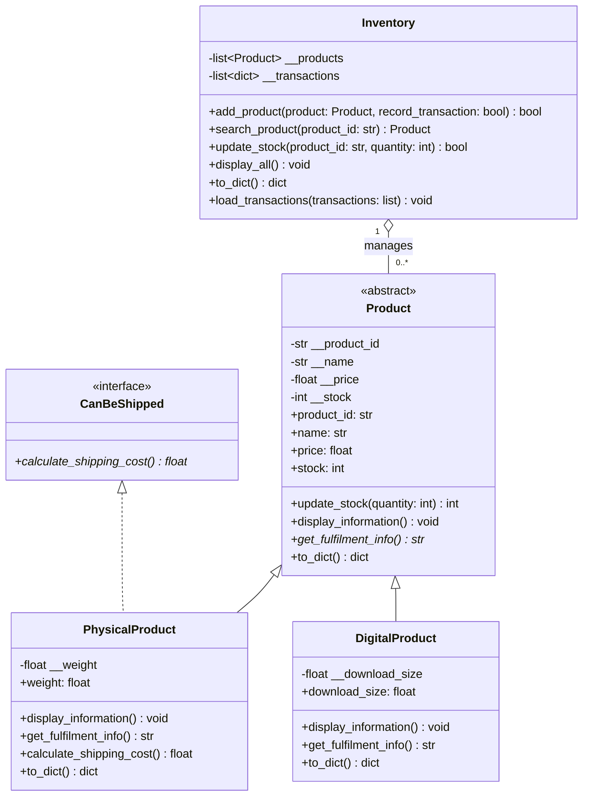

# Lab 7 UML Class Diagram

```mermaid
classDiagram
    class Product {
        <<abstract>>
        -str __product_id
        -str __name
        -float __price
        -int __stock
        +product_id: str
        +name: str
        +price: float
        +stock: int
        +update_stock(quantity: int) int
        +display_information() void
        +get_fulfilment_info()* str
        +to_dict() dict
    }
    class PhysicalProduct {
        -float __weight
        +weight: float
        +display_information() void
        +get_fulfilment_info() str
        +calculate_shipping_cost() float
        +to_dict() dict
    }
    class DigitalProduct {
        -float __download_size
        +download_size: float
        +display_information() void
        +get_fulfilment_info() str
        +to_dict() dict
    }
    class CanBeShipped {
        <<interface>>
        +calculate_shipping_cost()* float
    }
    class Inventory {
        -list~Product~ __products
        -list~dict~ __transactions
        +add_product(product: Product, record_transaction: bool) bool
        +search_product(product_id: str) Product
        +update_stock(product_id: str, quantity: int) bool
        +display_all() void
        +to_dict() dict
        +load_transactions(transactions: list) void
    }
    Product <|-- PhysicalProduct
    Product <|-- DigitalProduct
    CanBeShipped <|.. PhysicalProduct
    Inventory "1" o-- "0..*" Product : manages
```

The `@property` getters are shown as public read-only attributes. The diagram omits standalone menu/file functions, since they are not classes.
